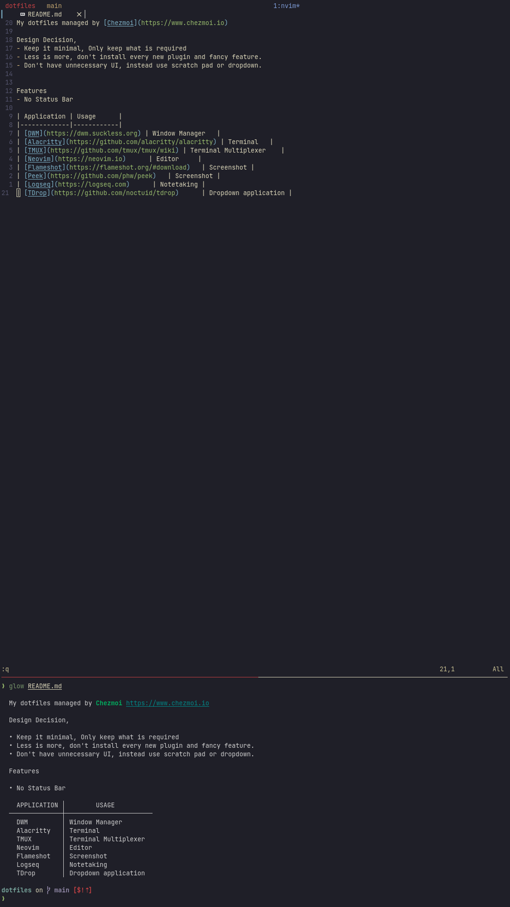

My dotfiles managed by [Chezmoi](https://www.chezmoi.io)

Design Guidelines,
- Keep it minimal, Only keep what is required 
- Less is more, don't install every new plugin and fancy feature.
- Don't have unnecessary UI, instead use scratch pad or dropdown.
- Embrace Unix Linux Philsophy

Screenshot

Features 
- No Status Bar 
- Minimal UI

| Application | Usage      |
|-------------|------------|
| [DWM](https://dwm.suckless.org) | Window Manager   |
| [Alacritty](https://github.com/alacritty/alacritty) | Terminal   |
| [TMUX](https://github.com/tmux/tmux/wiki) | Terminal Multiplexer    |
| [Neovim](https://neovim.io)      | Editor     |
| [Flameshot](https://flameshot.org/#download)   | Screenshot |
| [Peek](https://github.com/phw/peek)   | Screenshot |
| [Logseq](https://logseq.com)      | Notetaking |
| [TDrop](https://github.com/noctuid/tdrop)      | Dropdown application |

